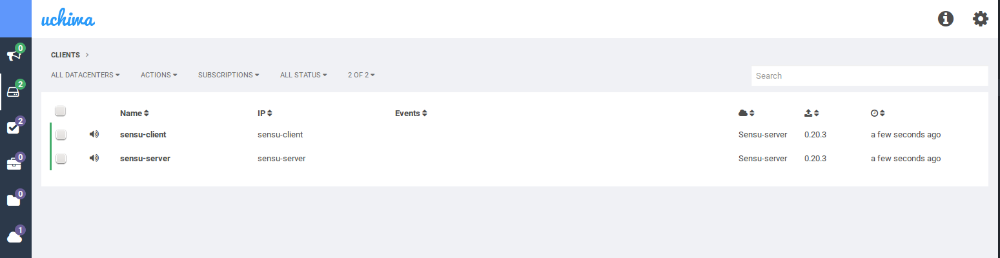
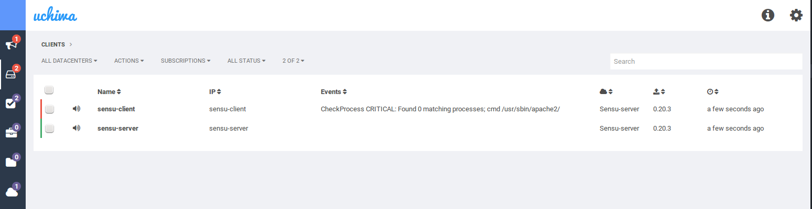

Sensu-docker-example
============

Dockerfiles for each component and Docker Compose file for setting up a Sensu server, RabbitMQ, Redis and sample Sensu client with alert example.

Installing Docker
-----------------
Follow the instructions on the docker site for your platform.
* [CentOS](https://docs.docker.com/installation/centos/)
* [Ubuntu Trusty](https://docs.docker.com/installation/ubuntulinux/#docker-maintained-package-installation)
* [Ubuntu Precise](https://docs.docker.com/installation/ubuntulinux/#ubuntu-precise-1204-lts-64-bit)


Installing Docker Compose
-------------------------

```bash
sudo apt-get -y install python-pip
sudo pip install docker-compose
```

Clone and Run the Sensu Docker
------------------------------

Clone the repo ```git clone https://github.com/hammon/sensu-docker.git```


Run ```docker-compose up -d``` from the sensu-docker directory.

When compose finished running, navigate to <http://127.0.0.1:3000/#/clients>

You will see Uchiwa console similar to this:




Trigger alert
-------------

Run ```./stop-client-apache.sh``` from the sensu-docker directory.

After about 30 seconds, alert will appear in the Uchiwa console:




Run ```./start-client-apache.sh``` from the sensu-docker directory to restore healthy state.
